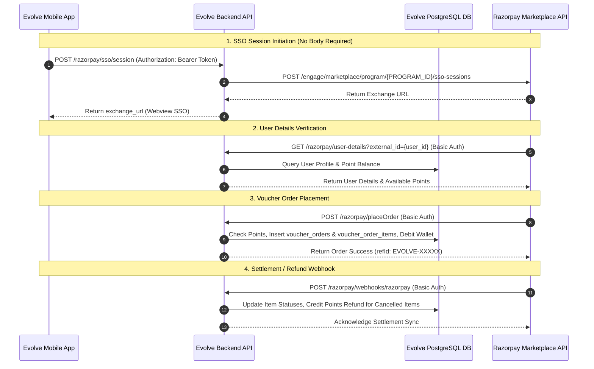

# Evolve & Razorpay Integration Specification & Implementation Document

This document outlines the complete technical architecture, database schemas, inbound and outbound API specifications, and the **entire production source code** for integrating the **Evolve Rewards & Loyalty Platform** with **Razorpay Marketplace / Rewards & Payouts**.

---

## User Review Required

> [!IMPORTANT]
> - All system components follow **Evolve** branding.
> - `POST /razorpay/sso/session` requires **no request body** (takes user identity from the Bearer token header).
> - All HTTP requests and responses (inbound and outbound) are audited in `tbl_razorpay_logs`.
> - The complete source code for all schemas, repository, middleware, router, controller, and service files is included below.

---

## Proposed System Architecture & Flow



---

## Database Schemas (Evolve Database)

### 1. `voucher_orders`
Stores order header details for digital voucher redemptions.

| Column | Type | Constraints | Description |
| :--- | :--- | :--- | :--- |
| `id` | `serial` | PRIMARY KEY | Internal order ID |
| `ref_id` | `varchar` | UNIQUE | Evolve reference ID (e.g. `EVOLVE-12345678`) |
| `user_id` | `varchar` | NOT NULL | Evolve User ID associated with order |
| `external_order_id` | `varchar` | UNIQUE, NOT NULL | Razorpay Order ID (`orderId`) |
| `total_cart_value` | `numeric(12,2)` | NOT NULL | Requested total points for order |
| `total_success_value` | `numeric(12,2)` | DEFAULT 0 | Successfully fulfilled points value |
| `order_status` | `enum` | NOT NULL | Status: `'CREATED'`, `'COMPLETED'`, `'REFUNDED'`, `'FAILED'` |
| `created_at` | `timestamp` | DEFAULT `now()` | Order timestamp |
| `updated_at` | `timestamp` | DEFAULT `now()` | Last update timestamp |

### 2. `voucher_order_items`
Stores individual voucher line items within each order.

| Column | Type | Constraints | Description |
| :--- | :--- | :--- | :--- |
| `id` | `serial` | PRIMARY KEY | Internal item ID |
| `order_id` | `integer` | FOREIGN KEY | References `voucher_orders.id` |
| `external_txn_id` | `varchar` | NOT NULL | Razorpay transaction ID (`txnId`) |
| `voucher_name` | `varchar` | NOT NULL | Name of voucher |
| `rate` | `numeric(10,2)` | NOT NULL | Point rate per item |
| `quantity` | `integer` | NOT NULL | Item quantity |
| `item_status` | `enum` | NOT NULL | Status: `'CREATED'`, `'COMPLETED'`, `'REFUNDED'`, `'FAILED'` |
| `txn_time` | `timestamp` | NOT NULL | Razorpay transaction timestamp |
| `created_at` | `timestamp` | DEFAULT `now()` | Creation timestamp |

### 3. `tbl_razorpay_logs`
Audit table storing raw request and response data for debugging and tracking.

| Column | Type | Constraints | Description |
| :--- | :--- | :--- | :--- |
| `id` | `serial` | PRIMARY KEY | Log primary key |
| `direction` | `varchar(20)` | NOT NULL | `'INCOMING'` (Evolve endpoint) or `'OUTGOING'` (Razorpay API) |
| `endpoint` | `text` | NOT NULL | API endpoint path / target URL |
| `method` | `varchar(10)` | NOT NULL | HTTP Method (`POST`, `GET`, etc.) |
| `headers` | `jsonb` | NULLABLE | Request headers (sanitized) |
| `request` | `jsonb` | NULLABLE | Request body / query parameters |
| `response` | `jsonb` | NULLABLE | Response body / payload |
| `status_code` | `integer` | NULLABLE | HTTP status code |
| `execution_time_ms` | `integer` | NULLABLE | Execution duration in ms |
| `error_message` | `text` | NULLABLE | Error details if applicable |
| `created_at` | `timestamp` | DEFAULT `now()` | Creation timestamp |

---

## API Specifications

### A. Inbound APIs (Exposed by Evolve for Razorpay)

#### 1. Initiate SSO Session
- **Route:** `POST /razorpay/sso/session`
- **Auth Header:** `Authorization: Bearer <Evolve_JWT_Token>`
- **Request Body:** None
- **Response (200 OK):**
  ```json
  {
    "success": true,
    "message": "SSO session created successfully",
    "exchange_url": "https://marketplace.razorpay.com/sso?token=..."
  }
  ```

#### 2. Get User Details
- **Route:** `GET /razorpay/user-details?external_id={user_id}`
- **Auth Header:** Basic Auth (`RAZORPAY_KEY_ID:RAZORPAY_KEY_SECRET`)
- **Response (200 OK):**
  ```json
  {
    "success": true,
    "data": {
      "userId": 123,
      "name": "John Doe",
      "mobileNumber": "9876543210",
      "email": "user@example.com",
      "currentBalance": 1500,
      "timestamp": "2026-07-28T12:00:00.000Z"
    },
    "message": "Success"
  }
  ```

#### 3. Place Order
- **Route:** `POST /razorpay/placeOrder`
- **Auth Header:** Basic Auth (`RAZORPAY_KEY_ID:RAZORPAY_KEY_SECRET`)
- **Request Body:**
  ```json
  {
    "external_id": "123",
    "orderId": "ORD_987654321",
    "totalCartValue": 500,
    "itemDetails": [
      {
        "txnId": "TXN_101",
        "voucherName": "Amazon Shopping Voucher",
        "rate": 500,
        "qty": 1,
        "txnTime": "2026-07-28T12:00:00Z"
      }
    ]
  }
  ```
- **Response (200 OK):**
  ```json
  {
    "status": "success",
    "code": "100",
    "orderId": "ORD_987654321",
    "refId": "EVOLVE-12345678",
    "userId": "123"
  }
  ```

#### 4. Settlement Webhook / Callback
- **Route:** `POST /razorpay/webhooks/razorpay`
- **Auth Header:** Basic Auth (`RAZORPAY_KEY_ID:RAZORPAY_KEY_SECRET`)
- **Request Body:**
  ```json
  {
    "userId": "123",
    "orderId": "ORD_987654321",
    "orderStatus": "C",
    "itemDetails": [
      {
        "txnId": "TXN_101",
        "status": "C"
      }
    ]
  }
  ```
- **Response (200 OK):**
  ```json
  {
    "status": "success",
    "code": "200",
    "refId": "ORDER-ORD_987654321",
    "orderId": "ORD_987654321",
    "orderStatus": "C",
    "userId": "123",
    "totalCartValue": 500
  }
  ```

#### 5. Order Status Inquiry
- **Route:** `POST /razorpay/orderStatus`
- **Auth Header:** Basic Auth (`RAZORPAY_KEY_ID:RAZORPAY_KEY_SECRET`)
- **Request Body:**
  ```json
  {
    "orderId": "ORD_987654321"
  }
  ```

#### 6. Verify Voucher Token
- **Route:** `POST /razorpay/sso/verify-token`
- **Request Body:**
  ```json
  {
    "token": "<RAZORPAY_VOUCHER_JWT_TOKEN>"
  }
  ```

---

## Complete Source Code Appendix

### 1. `src/schemas/razorpay-log-model.ts`
```typescript
import { integer, jsonb, pgTable, serial, text, timestamp, varchar } from "drizzle-orm/pg-core";

export const RazorpayLogModel = pgTable("tbl_razorpay_logs", {
  id: serial("id").primaryKey(),
  direction: varchar("direction", { length: 20 }).notNull(), // 'INCOMING' | 'OUTGOING'
  endpoint: text("endpoint").notNull(),
  method: varchar("method", { length: 10 }).notNull(),
  headers: jsonb("headers"),
  request: jsonb("request"),
  response: jsonb("response"),
  statusCode: integer("status_code"),
  executionTimeMs: integer("execution_time_ms"),
  errorMessage: text("error_message"),
  createdAt: timestamp("created_at", { withTimezone: true }).defaultNow().notNull(),
});
```

---

### 2. `src/schemas/voucher-orders-model.ts`
```typescript
import {
    pgTable,
    uuid,
    varchar,
    numeric,
    timestamp,
    index,
    uniqueIndex,
    serial,
} from "drizzle-orm/pg-core";
import { pgEnum } from "drizzle-orm/pg-core";

export const voucherOrderStatusEnum = pgEnum("voucher_order_status_enum", [
    "CREATED",
    "COMPLETED",
    "FAILED",
    "REFUNDED",
]);

export const voucherOrders = pgTable(
    "voucher_orders",
    {
        id: serial("id").primaryKey(),
        refId: uuid("ref_id").defaultRandom().notNull(),
        userId: varchar("user_id", { length: 100 }).notNull(),
        externalOrderId: varchar("external_order_id", { length: 50 }).notNull(),
        totalCartValue: numeric("total_cart_value", {
            precision: 12,
            scale: 2,
        }).notNull(),
        totalSuccessValue: numeric("total_success_value", {
            precision: 12,
            scale: 2,
        })
            .notNull()
            .default("0.00"),
        orderStatus: voucherOrderStatusEnum("order_status")
            .notNull()
            .default("CREATED"),
        createdAt: timestamp("created_at", { withTimezone: true })
            .notNull()
            .defaultNow(),
        updatedAt: timestamp("updated_at", { withTimezone: true })
            .notNull()
            .defaultNow(),
    },
    (table) => ({
        externalOrderIdx: uniqueIndex("uq_orders_external_order_id").on(
            table.externalOrderId
        ),
        userIdIdx: index("idx_orders_user_id").on(table.userId),
        createdAtIdx: index("idx_orders_created_at").on(table.createdAt),
    })
);
```

---

### 3. `src/schemas/voucher-order-items-model.ts`
```typescript
import {
    pgTable,
    uuid,
    varchar,
    numeric,
    integer,
    timestamp,
    uniqueIndex,
    index,
} from "drizzle-orm/pg-core";
import { voucherOrders } from "./voucher-orders-model";
import { pgEnum } from "drizzle-orm/pg-core";

export const voucherOrderItemStatusEnum = pgEnum("voucher_order_item_status_enum", [
    "CREATED",
    "COMPLETED",
    "FAILED",
    "REFUNDED",
]);

export const voucherOrderItems = pgTable(
    "voucher_order_items",
    {
        id: uuid("id").defaultRandom().primaryKey(),
        orderId: integer("order_id")
            .notNull()
            .references(() => voucherOrders.id, { onDelete: "cascade" }),
        externalTxnId: varchar("external_txn_id", { length: 50 }).notNull(),
        voucherName: varchar("voucher_name", { length: 255 }).notNull(),
        rate: numeric("rate", {
            precision: 12,
            scale: 2,
        }).notNull(),
        quantity: integer("quantity").notNull(),
        itemStatus: voucherOrderItemStatusEnum("item_status").notNull(),
        txnTime: timestamp("txn_time", { withTimezone: true }).notNull(),
        createdAt: timestamp("created_at", { withTimezone: true })
            .notNull()
            .defaultNow(),
    },
    (table) => ({
        orderTxnUniqueIdx: uniqueIndex("uq_order_items_order_txn").on(
            table.orderId,
            table.externalTxnId
        ),
        orderIdIdx: index("idx_order_items_order_id").on(table.orderId),
        statusIdx: index("idx_order_items_status").on(table.itemStatus),
    })
);
```

---

### 4. `src/repositories/razorpay-log-repository.ts`
```typescript
import { RazorpayLogModel } from "../schemas";
import { database } from "../server";

export interface CreateRazorpayLogInput {
  direction: "INCOMING" | "OUTGOING";
  endpoint: string;
  method: string;
  headers?: any;
  request?: any;
  response?: any;
  statusCode?: number;
  executionTimeMs?: number;
  errorMessage?: string;
}

export class RazorpayLogRepository {
  async log(payload: CreateRazorpayLogInput) {
    try {
      await database.insert(RazorpayLogModel).values({
        direction: payload.direction,
        endpoint: payload.endpoint,
        method: payload.method,
        headers: payload.headers ? payload.headers : null,
        request: payload.request ? payload.request : null,
        response: payload.response ? payload.response : null,
        statusCode: payload.statusCode ?? null,
        executionTimeMs: payload.executionTimeMs ?? null,
        errorMessage: payload.errorMessage ?? null,
        createdAt: new Date(),
      });
    } catch (error) {
      console.error("Failed to insert Razorpay log into DB:", error);
    }
  }
}

export const razorpayLogRepository = new RazorpayLogRepository();
```

---

### 5. `src/middlewares/razorpay-logger-middleware.ts`
```typescript
import { NextFunction, Request, Response } from "express";
import { razorpayLogRepository } from "../repositories";

export const razorpayLoggerMiddleware = (req: Request, res: Response, next: NextFunction) => {
  const startTime = Date.now();

  const sanitizedHeaders: Record<string, any> = { ...req.headers };
  if (typeof sanitizedHeaders.authorization === "string") {
    if (sanitizedHeaders.authorization.startsWith("Basic ")) {
      sanitizedHeaders.authorization = "Basic ***MASKED***";
    }
  }

  const requestData = {
    body: req.body,
    query: req.query,
    params: req.params,
  };

  let responseBody: any = null;

  const originalJson = res.json;
  res.json = function (body: any) {
    responseBody = body;
    return originalJson.call(this, body);
  };

  const originalSend = res.send;
  res.send = function (body: any) {
    if (responseBody === null) {
      try {
        responseBody = typeof body === "string" ? JSON.parse(body) : body;
      } catch {
        responseBody = body;
      }
    }
    return originalSend.call(this, body);
  };

  res.on("finish", () => {
    const duration = Date.now() - startTime;
    razorpayLogRepository.log({
      direction: "INCOMING",
      endpoint: req.originalUrl || req.url,
      method: req.method,
      headers: sanitizedHeaders,
      request: requestData,
      response: responseBody,
      statusCode: res.statusCode,
      executionTimeMs: duration,
    }).catch((err) => {
      console.error("Error in razorpayLoggerMiddleware logging:", err);
    });
  });

  next();
};
```

---

### 6. `src/routes/razorpay-router.ts`
```typescript
import express, { Router } from "express";
import { razorpayController } from "../controllers";
import { authMiddleware } from "../middlewares/auth-middleware";
import { razorpayLoggerMiddleware } from "../middlewares/razorpay-logger-middleware";

const router: Router = express.Router();

router.use(razorpayLoggerMiddleware);

router.post(
    "/sso/session",
    authMiddleware.verifyToken,
    razorpayController.initiateSsoSession
);
router.get("/user-details", razorpayController.getUserDetails);
router.post("/placeOrder", razorpayController.placeOrder);
router.post("/webhooks/razorpay", razorpayController.settlementCallback);
router.post("/orderStatus", razorpayController.getOrderStatus);
router.post("/sso/verify-token", razorpayController.verifyVoucherToken);

export default router;
```

---

### 7. `src/controllers/razorpay-controller.ts`
```typescript
import { NextFunction, Request, Response } from "express";
import { razorpayService } from "../services";
import { CustomError } from "../types";
import { RAZORPAY_KEY_ID, RAZORPAY_KEY_SECRET, RAZORPAY_VOUCHER_KEY, RAZORPAY_VOUCHER_SECRET } from "../configs/config";
import { authMiddleware } from "../middlewares/auth-middleware";
import { UserRepository } from "../repositories/user-repository";
import { database } from "../server";
import { voucherOrders } from "../schemas/voucher-orders-model";
import { voucherOrderItems } from "../schemas/voucher-order-items-model";
import { and, eq, sql } from "drizzle-orm";
import { MechanicModel, PassbookAuditModel } from "../schemas";

class RazorpayController {
    initiateSsoSession = async (req: Request, res: Response, next: NextFunction) => {
        try {
            const token = req.headers.authorization?.split(" ")[1];
            if (!token) {
                throw new CustomError({
                    responseMessage: "Token is required for creating SSO session",
                    statusCode: 400,
                    responseCode: 400
                });
            }

            const razorpayVoucherToken = await authMiddleware.generateRazorpayVoucherToken(token);
            const userId = req.userDetails?.userId;

            const data = await razorpayService.createSsoSession(razorpayVoucherToken, userId);
            if (data?.exchange_url) {
                return res.status(200).json({
                    success: true,
                    message: "SSO session created successfully",
                    exchange_url: data?.exchange_url,
                });
            } else {
                throw new CustomError({
                    responseMessage: "Unable to create SSO session due to empty exchange URL",
                    responseCode: 400
                })
            }
        } catch (error) {
            next(error);
        }
    };

    getUserDetails = async (req: Request, res: Response, next: NextFunction) => {
        try {
            const authHeader = req.headers.authorization;
            if (!authHeader || !authHeader.startsWith("Basic ")) {
                return res.status(401).json({
                    message: "Unauthorized: Missing or invalid basic auth header",
                });
            }
            const base64Credentials = authHeader.split(" ")[1];
            const credentials = Buffer.from(base64Credentials, "base64").toString("utf-8");
            const [username, password] = credentials.split(":");

            const isValid = (username === RAZORPAY_KEY_ID && password === RAZORPAY_KEY_SECRET) ||
                (username === RAZORPAY_VOUCHER_KEY && password === RAZORPAY_VOUCHER_SECRET);
            if (!isValid) {
                return res.status(401).json({
                    message: "Unauthorized: Invalid basic auth credentials",
                });
            }

            const externalId = req.query.external_id;
            if (!externalId) {
                return res.status(400).json({
                    message: "Bad Request: Missing external_id",
                });
            }

            const userRepository = new UserRepository();
            let userDetails = null;
            if (!isNaN(Number(externalId))) {
                userDetails = await userRepository.getUserDetailsByUserId(Number(externalId));
            }
            if (!userDetails) {
                userDetails = await userRepository.getUserDetailsByUserCode(String(externalId));
            }

            if (!userDetails) {
                return res.status(404).json({
                    message: "User not found",
                });
            }

            const response = {
                success: true,
                data: {
                    userId: userDetails.userId,
                    name: userDetails.userName,
                    mobileNumber: userDetails.userMobile,
                    email: userDetails.userEmail,
                    currentBalance: userDetails.pointSummary.balancePoints,
                    timestamp: new Date().toISOString()
                },
                message: "Success"
            };

            return res.status(200).json(response);
        } catch (error) {
            next(error);
        }
    };

    placeOrder = async (req: Request, res: Response, next: NextFunction) => {
        let orderId: string | undefined;
        let resolvedUserId: string | undefined;
        try {
            const authHeader = req.headers.authorization;
            if (!authHeader || !authHeader.startsWith("Basic ")) {
                return res.status(401).json({
                    message: "Unauthorized: Missing or invalid basic auth header",
                });
            }
            const base64Credentials = authHeader.split(" ")[1];
            const credentials = Buffer.from(base64Credentials, "base64").toString("utf-8");
            const [username, password] = credentials.split(":");

            const isValid = (username === RAZORPAY_KEY_ID && password === RAZORPAY_KEY_SECRET) ||
                (username === RAZORPAY_VOUCHER_KEY && password === RAZORPAY_VOUCHER_SECRET);
            if (!isValid) {
                return res.status(401).json({
                    message: "Unauthorized: Invalid basic auth credentials",
                });
            }

            const { external_id, userId, user_id, totalCartValue, itemDetails } = req.body;
            const targetExternalId = external_id || userId || user_id;

            if (!targetExternalId) {
                return res.status(400).json({
                    message: "Bad Request: Missing external_id in body",
                });
            }

            const userRepository = new UserRepository();
            let userDetails = null;
            if (!isNaN(Number(targetExternalId))) {
                userDetails = await userRepository.getUserDetailsByUserId(Number(targetExternalId));
            }
            if (!userDetails) {
                userDetails = await userRepository.getUserDetailsByUserCode(String(targetExternalId));
            }

            if (!userDetails || !userDetails.userId) {
                return res.status(404).json({
                    message: "User not found associated with this request",
                });
            }

            ({ orderId } = req.body);
            resolvedUserId = String(userDetails.userId);

            if (!orderId || !totalCartValue || !Array.isArray(itemDetails)) {
                return res.status(400).json({
                    message: "Invalid request payload: Missing required fields",
                });
            }

            const expectedTotal = itemDetails.reduce((sum: number, item: any) => sum + (Number(item.rate) * Number(item.qty)), 0);

            if (Number(totalCartValue) !== expectedTotal) {
                return res.status(400).json({
                    status: "error",
                    code: "400",
                    message: `Cart value mismatch: expected ${expectedTotal}, received ${totalCartValue}`,
                    orderId: orderId,
                    userId: resolvedUserId,
                    expectedTotal: expectedTotal,
                    receivedTotal: Number(totalCartValue)
                });
            }

            const isInsufficientBalance = Number(userDetails.pointSummary.balancePoints) < Number(totalCartValue);

            const result = await database.transaction(async (tx) => {
                let successValue = 0;
                let orderStatus = "CREATED";

                if (isInsufficientBalance) {
                    orderStatus = "FAILED";
                    successValue = 0;
                }

                const [insertedOrder] = await tx.insert(voucherOrders).values({
                    userId: String(userDetails.userId),
                    externalOrderId: orderId!,
                    totalCartValue: String(totalCartValue),
                    totalSuccessValue: String(successValue),
                    orderStatus: orderStatus as any,
                }).returning();

                const itemsToInsert = itemDetails.map((item: any) => ({
                    orderId: insertedOrder.id,
                    externalTxnId: item.txnId,
                    voucherName: item.voucherName,
                    rate: String(item.rate),
                    quantity: item.qty,
                    itemStatus: (isInsufficientBalance ? "FAILED" : "CREATED") as any,
                    txnTime: item.txnTime ? new Date(item.txnTime) : new Date(),
                }));

                const insertedItems = await tx.insert(voucherOrderItems).values(itemsToInsert).returning();

                if (!isInsufficientBalance) {
                    await tx.update(MechanicModel).set({
                        redeemablePoints: sql`${MechanicModel.redeemablePoints} - ${totalCartValue}`,
                        balancePoints: sql`${MechanicModel.balancePoints} - ${totalCartValue}`,
                        redeemedPoints: sql`${MechanicModel.redeemedPoints} + ${totalCartValue}`
                    }).where(eq(MechanicModel.userId, userDetails.userId));

                    await tx.insert(PassbookAuditModel).values({
                        userId: userDetails.userId,
                        type: "Redeem",
                        action: "VOUCHER",
                        amount: String(totalCartValue),
                        openingBalance: String(userDetails.pointSummary.balancePoints),
                        closingBalance: String(Number(userDetails.pointSummary.balancePoints) - Number(totalCartValue)),
                        referenceId: orderId,
                        meta: { redemptionRef: orderId }
                    });
                }

                return { order: insertedOrder, items: insertedItems };
            });

            if (isInsufficientBalance) {
                return res.status(400).json({
                    message: "Insufficient balance",
                });
            }

            return res.status(200).json({
                status: "success",
                code: "100",
                orderId: result.order.externalOrderId,
                refId: result.order.refId,
                userId: String(userDetails.userId),
            });

        } catch (error: any) {
            if (error.code === '23505' && error.constraint === 'uq_orders_external_order_id') {
                return res.status(200).json({
                    status: "error",
                    code: "500",
                    message: "Redemption already exists for this order",
                    orderId: orderId,
                    userId: resolvedUserId,
                });
            }
            next(error);
        }
    };

    settlementCallback = async (req: Request, res: Response, next: NextFunction) => {
        try {
            const authHeader = req.headers.authorization;
            if (!authHeader || !authHeader.startsWith("Basic ")) {
                return res.status(401).json({
                    message: "Unauthorized: Missing or invalid basic auth header",
                });
            }
            const base64Credentials = authHeader.split(" ")[1];
            const credentials = Buffer.from(base64Credentials, "base64").toString("utf-8");
            const [username, password] = credentials.split(":");

            const isValid = (username === RAZORPAY_KEY_ID && password === RAZORPAY_KEY_SECRET) ||
                (username === RAZORPAY_VOUCHER_KEY && password === RAZORPAY_VOUCHER_SECRET);
            if (!isValid) {
                return res.status(401).json({
                    message: "Unauthorized: Invalid basic auth credentials",
                });
            }

            const { userId, orderId, orderStatus, itemDetails } = req.body;

            if (!orderId || !orderStatus || !Array.isArray(itemDetails)) {
                return res.status(400).json({
                    message: "Invalid payload: Missing required fields",
                });
            }

            const internalStatus = orderStatus === 'R' ? 'REFUNDED' : (orderStatus === 'C' ? 'COMPLETED' : 'FAILED');
            if (internalStatus === 'FAILED') {
                return res.status(400).json({
                    message: "Invalid Order Status Provided",
                });
            }

            const result = await database.transaction(async (tx) => {
                const [existingOrder] = await tx.select().from(voucherOrders).where(eq(voucherOrders.externalOrderId, orderId));

                if (!existingOrder) {
                    throw new Error("Order Not Found");
                }

                if (existingOrder.orderStatus === "COMPLETED" || existingOrder.orderStatus === "REFUNDED" || existingOrder.orderStatus === "FAILED") {
                    if (existingOrder.orderStatus === internalStatus) {
                        const existingItems = await tx.select().from(voucherOrderItems).where(eq(voucherOrderItems.orderId, existingOrder.id));
                        return { order: existingOrder, items: existingItems, isIdempotent: true };
                    }
                    throw new Error("Order already settled with a different status");
                }

                const updatedItems = [];
                let refundAmount = 0;

                for (const item of itemDetails) {
                    const itemInternalStatus = item.status === 'R' ? 'REFUNDED' : (item.status === 'C' ? 'COMPLETED' : 'FAILED');

                    const [updatedItem] = await tx
                        .update(voucherOrderItems)
                        .set({
                            itemStatus: itemInternalStatus as any,
                        })
                        .where(
                            and(
                                eq(voucherOrderItems.orderId, existingOrder.id),
                                eq(voucherOrderItems.externalTxnId, item.txnId),
                                eq(voucherOrderItems.itemStatus, "CREATED")
                            )
                        )
                        .returning();

                    if (updatedItem) {
                        updatedItems.push(updatedItem);
                        if (updatedItem.itemStatus === 'REFUNDED') {
                            refundAmount += Number(updatedItem.rate) * Number(updatedItem.quantity);
                        }
                    }
                }

                if (refundAmount > 0) {
                    const userId = Number(existingOrder.userId);
                    const [mechanic] = await tx.select().from(MechanicModel).where(eq(MechanicModel.userId, userId));

                    if (mechanic) {
                        const currentBalance = Number(mechanic.balancePoints);

                        await tx.update(MechanicModel).set({
                            redeemablePoints: sql`${MechanicModel.redeemablePoints} + ${refundAmount}`,
                            balancePoints: sql`${MechanicModel.balancePoints} + ${refundAmount}`,
                            redeemedPoints: sql`${MechanicModel.redeemedPoints} - ${refundAmount}`
                        }).where(eq(MechanicModel.userId, userId));

                        await tx.insert(PassbookAuditModel).values({
                            userId: userId,
                            type: "Earn",
                            action: "REFUND",
                            amount: String(refundAmount),
                            openingBalance: String(currentBalance),
                            closingBalance: String(currentBalance + refundAmount),
                            referenceId: existingOrder.externalOrderId,
                            meta: { redemptionRef: existingOrder.externalOrderId }
                        });
                    }
                }

                const allItems = await tx.select().from(voucherOrderItems).where(eq(voucherOrderItems.orderId, existingOrder.id));

                let newOrderStatus = "FAILED";
                const isAnyCompleted = allItems.some(item => item.itemStatus === "COMPLETED");
                const isAllRefunded = allItems.every(item => item.itemStatus === "REFUNDED");
                const isAnyCreated = allItems.some(item => item.itemStatus === "CREATED");

                if (isAnyCompleted) {
                    newOrderStatus = "COMPLETED";
                } else if (isAllRefunded) {
                    newOrderStatus = "REFUNDED";
                } else if (isAnyCreated) {
                    newOrderStatus = "CREATED";
                }

                const successValue = allItems
                    .filter((item) => item.itemStatus === "COMPLETED")
                    .reduce((acc, item) => acc + (Number(item.rate) * Number(item.quantity)), 0);

                const [updatedOrder] = await tx
                    .update(voucherOrders)
                    .set({
                        orderStatus: newOrderStatus as any,
                        totalSuccessValue: String(successValue),
                        updatedAt: new Date(),
                    })
                    .where(eq(voucherOrders.id, existingOrder.id))
                    .returning();

                return { order: updatedOrder, items: allItems, isIdempotent: false };
            });

            if (!result.order) {
                return res.status(404).json({
                    status: "error",
                    code: "404",
                    message: "Order not found",
                    orderId: orderId
                });
            }

            const responseOrderStatus = result.order.orderStatus === 'REFUNDED' ? 'R' : (result.order.orderStatus === 'COMPLETED' ? 'C' : result.order.orderStatus);

            const userRepository = new UserRepository();
            let userMobile = "";
            try {
                const userDetails = await userRepository.getUserDetailsByUserId(Number(result.order.userId));
                userMobile = userDetails.userMobile || "";
            } catch (err) {
                // Ignore
            }

            return res.status(200).json({
                status: "success",
                code: "200",
                refId: `ORDER-${result.order.externalOrderId}`,
                orderId: result.order.externalOrderId,
                orderStatus: responseOrderStatus,
                userId: result.order.userId,
                mobileNumber: userMobile,
                totalCartValue: Number(result.order.totalCartValue),
                itemDetails: result.items.map(item => ({
                    txnId: item.externalTxnId,
                    voucherName: item.voucherName,
                    rate: Number(item.rate),
                    qty: item.quantity,
                    status: item.itemStatus === 'REFUNDED' ? 'R' : (item.itemStatus === 'COMPLETED' ? 'C' : item.itemStatus)
                }))
            });

        } catch (error: any) {
            if (error.message === "Order Not Found") return res.status(404).json({
                status: "error",
                code: "404",
                message: "Order not found",
                orderId: req.body?.orderId
            });
            if (error.message === "Order already settled with a different status") return res.status(200).json({
                status: "success",
                code: "200",
                message: "order already settled",
                orderId: req.body?.orderId
            });
            next(error);
        }
    };

    getOrderStatus = async (req: Request, res: Response, next: NextFunction) => {
        try {
            const authHeader = req.headers.authorization;
            if (!authHeader || !authHeader.startsWith("Basic ")) {
                return res.status(401).json({
                    message: "Unauthorized: Missing or invalid basic auth header",
                });
            }
            const base64Credentials = authHeader.split(" ")[1];
            const credentials = Buffer.from(base64Credentials, "base64").toString("utf-8");
            const [username, password] = credentials.split(":");

            const isValid = (username === RAZORPAY_KEY_ID && password === RAZORPAY_KEY_SECRET) ||
                (username === RAZORPAY_VOUCHER_KEY && password === RAZORPAY_VOUCHER_SECRET);
            if (!isValid) {
                return res.status(401).json({
                    message: "Unauthorized: Invalid basic auth credentials",
                });
            }

            const { orderId } = req.body;

            if (!orderId) {
                return res.status(400).json({
                    message: "Invalid request payload: Missing orderId",
                });
            }

            const [order] = await database
                .select()
                .from(voucherOrders)
                .where(eq(voucherOrders.externalOrderId, orderId));

            if (!order) {
                return res.status(404).json({
                    status: "failed",
                    code: "404",
                    message: "Order not found",
                    orderId: orderId
                });
            }

            const items = await database
                .select()
                .from(voucherOrderItems)
                .where(eq(voucherOrderItems.orderId, order.id));

            return res.status(200).json({
                status: "success",
                code: "200",
                refId: order.refId,
                orderId: order.externalOrderId,
                itemDetails: items.map(item => ({
                    txnId: item.externalTxnId,
                    voucherName: item.voucherName,
                    rate: Number(item.rate),
                    qty: item.quantity,
                    status: item.itemStatus,
                    txnTime: item.txnTime.toISOString()
                }))
            });

        } catch (error) {
            next(error);
        }
    };

    verifyVoucherToken = async (req: Request, res: Response, next: NextFunction) => {
        try {
            const token = req.body.token || req.headers.authorization?.split(" ")[1];
            if (!token) {
                throw new CustomError({
                    responseMessage: "Token is required for verification",
                    statusCode: 400,
                    responseCode: 400
                });
            }

            const decoded = authMiddleware.verifyRazorpayVoucherToken(token);

            return res.status(200).json({
                success: true,
                message: "Voucher token verified successfully",
                data: decoded
            });
        } catch (error) {
            next(error);
        }
    };
}

export const razorpayController = new RazorpayController();
```

---

### 8. `src/services/razorpay-service.ts`
```typescript
import axios, { AxiosInstance, AxiosError } from "axios";
import crypto from "crypto";
import { PROGRAM_ID, RAZORPAY_ACCOUNT_NUMBER, RAZORPAY_BASE_URL, RAZORPAY_KEY_ID, RAZORPAY_KEY_SECRET, RAZORPAY_TIMEOUT, RAZORPAY_VOUCHER_KEY, RAZORPAY_VOUCHER_SECRET, RAZORPAY_WEBHOOK_SECRET } from "../configs/config";
import { CustomError, PayoutRequest, PayoutResponse, RazorpayError, ServiceProviderLog, TempApiLog } from "../types";
import { loggerRepository, razorpayLogRepository } from "../repositories";
import { RedisClient } from "./redis-client";
import { Request } from "express";
import { redemptionRepository } from "../repositories/redemption-repository";

export class RazorpayService {
    private client: AxiosInstance;
    private redisClient = RedisClient.getInstance();

    constructor() {
        this.client = axios.create({
            baseURL: RAZORPAY_BASE_URL,
            timeout: RAZORPAY_TIMEOUT,
            auth: {
                username: RAZORPAY_KEY_ID,
                password: RAZORPAY_KEY_SECRET,
            },
            headers: {
                'Content-Type': 'application/json',
            },
        });
    }

    private async checkIdempotency(key: string): Promise<PayoutResponse | null> {
        if (this.redisClient.isLive()) {
            const cached = await this.redisClient.getValueString(`idempotency:razorpay:${key}`);
            return cached ? JSON.parse(cached) : null;
        }
        return null;
    }

    private async storeIdempotency(key: string, data: PayoutResponse) {
        if (this.redisClient.isLive()) {
            await this.redisClient.setKeyString(`idempotency:razorpay:${key}`, JSON.stringify(data));
        }
    }

    async redemptionPayout(data: { redemptionId: number; redemptionRef: string; points: string; type: string; partnerData: any; userDetails: any; }) {
        const payoutRequest: PayoutRequest = {
            account_number: RAZORPAY_ACCOUNT_NUMBER,
            reference_id: data.redemptionRef,
            amount: Number(data.points) * 100, // Convert to paise
            currency: "INR",
            mode: data.type === "upi" ? "UPI" : "IMPS",
            purpose: "payout",
            fund_account: {
                account_type: data.type === "upi" ? "vpa" : "bank_account",
                ...(data.type === "bank-transfer" && {
                    bank_account: {
                        name: data?.partnerData?.accountHolderName,
                        ifsc: data?.partnerData?.accountIfsc,
                        account_number: data?.partnerData?.accountNumber,
                    },
                }),
                ...(data.type === "upi" && {
                    vpa: {
                        address: data?.partnerData?.upiId,
                    },
                }),
                contact: {
                    name: data?.userDetails?.userName || "",
                    email: data?.userDetails?.userEmail || "",
                    contact: data?.userDetails?.userMobile || "",
                    type: "customer",
                    reference_id: data?.userDetails?.userCode || "",
                },
                queue_if_low_balance: true,
                notes: {},
            },
        };

        return this.createPayout(payoutRequest, data.redemptionId, data.userDetails.userId);
    }

    async createPayout(
        request: PayoutRequest,
        redemptionId: number,
        createdBy?: number
    ): Promise<PayoutResponse> {
        const url = "payouts";
        const fullUrl = (this.client.defaults.baseURL || "") + url;
        const startTime = Date.now();
        const logData = new ServiceProviderLog({
            url: fullUrl,
            request: JSON.stringify(request),
            response: "",
            createdAt: new Date(),
            createdBy: createdBy || 0,
        });

        let statusCode = 200;
        let responsePayload: any = null;
        let errorMessage: string | undefined = undefined;

        try {
            const response = await this.client.post<PayoutResponse>(url, request);
            statusCode = response.status;
            responsePayload = response?.data;
            logData.response = JSON.stringify(response?.data);
            await redemptionRepository.updateRazorpayResponse(redemptionId, response?.data);

            return response.data;
        } catch (error: any) {
            const axiosError = error as AxiosError<RazorpayError>;
            statusCode = axiosError?.response?.status || 500;
            const errorDescription = axiosError?.response?.data?.error?.description || error?.message;
            errorMessage = errorDescription;
            responsePayload = axiosError?.response?.data || error?.message;
            logData.response = JSON.stringify(responsePayload);

            throw new CustomError({
                responseMessage: errorDescription,
                statusCode: statusCode
            });
        } finally {
            loggerRepository.serviceProviderInsert(logData);
            razorpayLogRepository.log({
                direction: "OUTGOING",
                endpoint: fullUrl,
                method: "POST",
                request,
                response: responsePayload,
                statusCode,
                executionTimeMs: Date.now() - startTime,
                errorMessage,
            }).catch(err => console.error("Error logging outgoing createPayout:", err));
        }
    }

    async getPayoutStatus(payoutId: string, redemptionId?: number, createdBy?: number): Promise<PayoutResponse> {
        const url = `payouts/${payoutId}`;
        const fullUrl = (this.client.defaults.baseURL || "") + url;
        const startTime = Date.now();
        const logData = new ServiceProviderLog({
            url: fullUrl,
            request: JSON.stringify({ payoutId }),
            response: "",
            createdAt: new Date(),
            createdBy: createdBy || 0,
        });

        let statusCode = 200;
        let responsePayload: any = null;
        let errorMessage: string | undefined = undefined;

        try {
            const response = await this.client.get<PayoutResponse>(url);
            statusCode = response.status;
            responsePayload = response?.data;
            logData.response = JSON.stringify(response?.data);

            return response.data;
        } catch (error: any) {
            const axiosError = error as AxiosError<RazorpayError>;
            statusCode = axiosError?.response?.status || 500;
            errorMessage = axiosError?.response?.data?.error?.description || 'Failed to fetch payout status';
            responsePayload = axiosError?.response?.data || error?.message;
            logData.response = JSON.stringify(responsePayload);

            throw new CustomError({
                responseMessage: errorMessage,
                statusCode
            });
        } finally {
            loggerRepository.serviceProviderInsert(logData);
            razorpayLogRepository.log({
                direction: "OUTGOING",
                endpoint: fullUrl,
                method: "GET",
                request: { payoutId },
                response: responsePayload,
                statusCode,
                executionTimeMs: Date.now() - startTime,
                errorMessage,
            }).catch(err => console.error("Error logging outgoing getPayoutStatus:", err));
        }
    }

    async createSsoSession(
        token: string,
        createdBy?: number
    ): Promise<{ exchange_url: string }> {
        const url = `engage/marketplace/program/${PROGRAM_ID}/sso-sessions`;
        const fullUrl = (this.client.defaults.baseURL || "") + url;
        const startTime = Date.now();
        const logData = new ServiceProviderLog({
            url: fullUrl,
            request: JSON.stringify({ token }),
            response: "",
            createdAt: new Date(),
            createdBy: createdBy || 0,
        });

        let statusCode = 200;
        let responsePayload: any = null;
        let errorMessage: string | undefined = undefined;

        try {
            const response = await this.client.post<{ exchange_url: string }>(
                url,
                { token },
                {
                    auth: {
                        username: RAZORPAY_VOUCHER_KEY || RAZORPAY_KEY_ID,
                        password: RAZORPAY_VOUCHER_SECRET || RAZORPAY_KEY_SECRET,
                    },
                }
            );
            statusCode = response.status;
            responsePayload = response?.data;
            logData.response = JSON.stringify(response?.data);

            return response.data;
        } catch (error: any) {
            const axiosError = error as AxiosError<any>;
            statusCode = axiosError?.response?.status || 500;
            const errorData = axiosError?.response?.data;
            errorMessage = errorData?.error?.description || errorData?.message || error?.message;
            responsePayload = errorData || error?.message;
            logData.response = JSON.stringify(responsePayload);

            throw new CustomError({
                responseMessage: errorMessage,
                statusCode: statusCode,
                responseCode: statusCode
            });
        } finally {
            loggerRepository.serviceProviderInsert(logData);
            razorpayLogRepository.log({
                direction: "OUTGOING",
                endpoint: fullUrl,
                method: "POST",
                request: { token: "***MASKED***" },
                response: responsePayload,
                statusCode,
                executionTimeMs: Date.now() - startTime,
                errorMessage,
            }).catch(err => console.error("Error logging outgoing createSsoSession:", err));
        }
    }

    verifyWebhookSignature(payload: string, signature: string): boolean {
        const hmac = crypto.createHmac("sha256", RAZORPAY_WEBHOOK_SECRET || "");
        hmac.update(payload);
        const generatedSignature = hmac.digest("hex");
        return generatedSignature === signature;
    }

    async logWebhook(req: Request, response: any) {
        const tempLog = new ServiceProviderLog({
            request: JSON.stringify(req.body),
            response: JSON.stringify(response),
            url: req?.url,
            createdAt: new Date()
        });
        await loggerRepository.serviceProviderInsert(tempLog);
    }
}

export const razorpayService = new RazorpayService();
```

---

### 9. `src/database/migrations/0061_mature_hiroim.sql`
```sql
CREATE TABLE IF NOT EXISTS "tbl_razorpay_logs" (
	"id" serial PRIMARY KEY NOT NULL,
	"direction" varchar(20) NOT NULL,
	"endpoint" text NOT NULL,
	"method" varchar(10) NOT NULL,
	"headers" jsonb,
	"request" jsonb,
	"response" jsonb,
	"status_code" integer,
	"execution_time_ms" integer,
	"error_message" text,
	"created_at" timestamp with time zone DEFAULT now() NOT NULL
);
```
